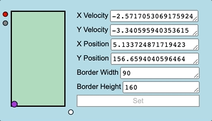
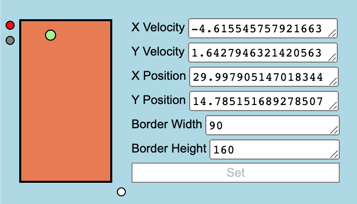

# Drum Square #

This project implements a simple drum machine that uses a bouncing ball inside a rectangle to determine when drum sounds should be triggered. A different drum sound plays based on which edge of the rectangle the ball bounces off of, with the following orientation:

- Bottom edge: bass drum
- Left edge: high hi-hat
- Rigth edge: low hi-hat
- Top edge: snare

I mostly wrote this as a way to learn Javascript, but it's also fun to mess around with and can produce unusual drum patterns that most other drum machines wouldn't be able to replicate. 

## Controls

- Click the red dot in the top left corner to pause the drum machine
- Click the grey dot in the top left corner to show or hide the number panel
- Click inside the drum machine rectangle to randomize all of the drum machine's colors and variables
- To change the values of drum machine parameters manually, pause the drum machine, change values in the number panel, then click 'set' to apply the changes
- Click and drag the bottom left corner of the drum machine rectangle to adjust the height of the rectangle
- Click and drag the top right corner of the drum machine rectangle to adjust the width of the rectangle
- Click and drag the bottom right corner of the drum machine rectangle to evenly scale the height and width of the rectangle at the same time
- Click and drag the grey dot at the bottom right of the drum machine rectangle to freely adjust both the height and width of the rectangle at the same time

